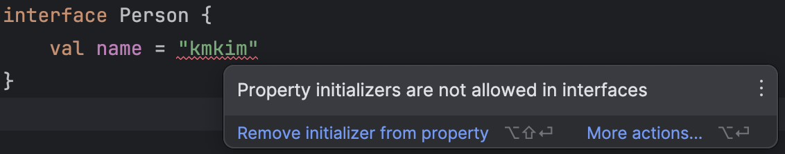
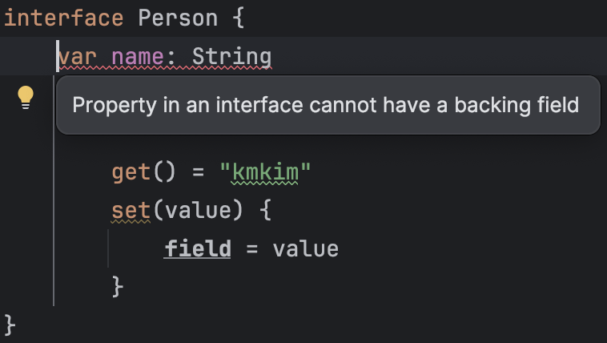
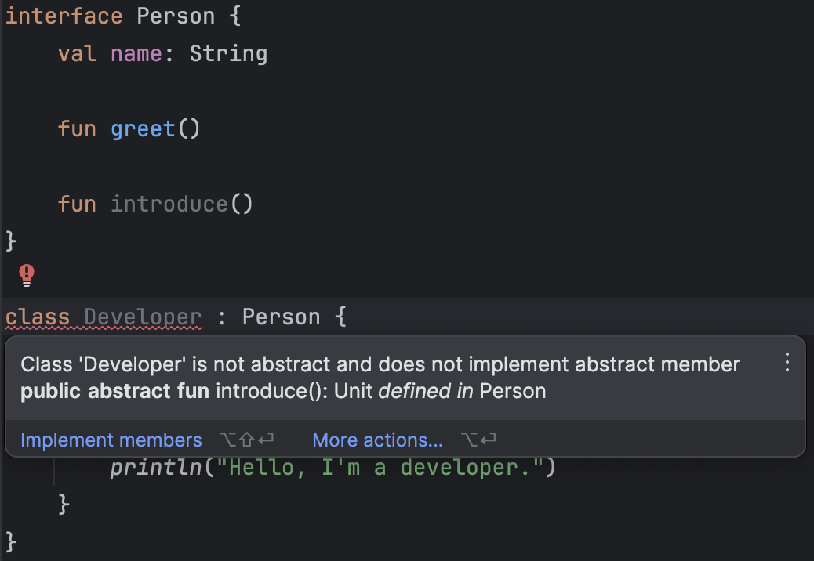
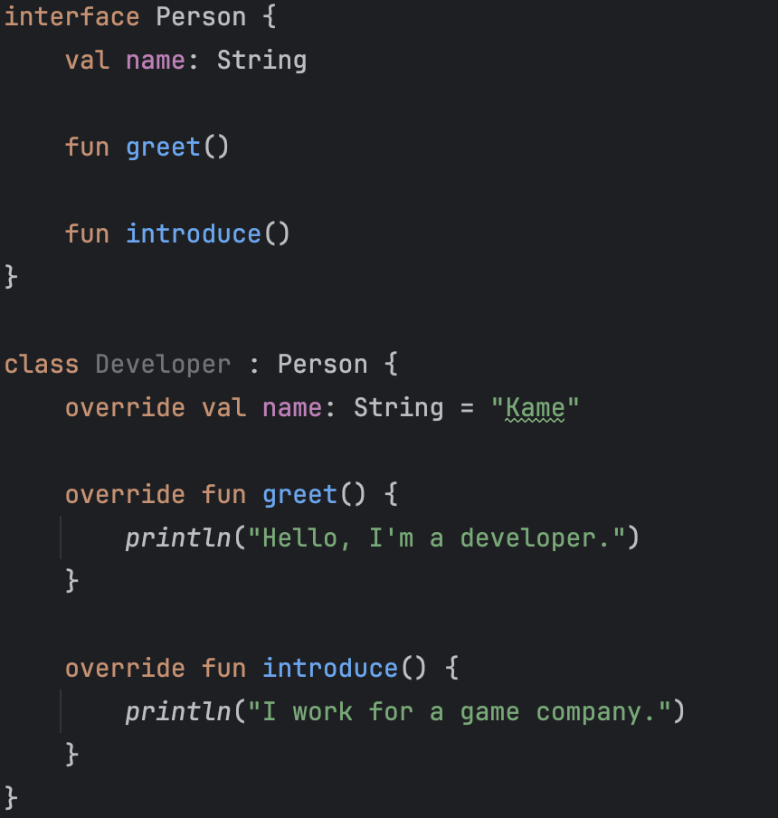
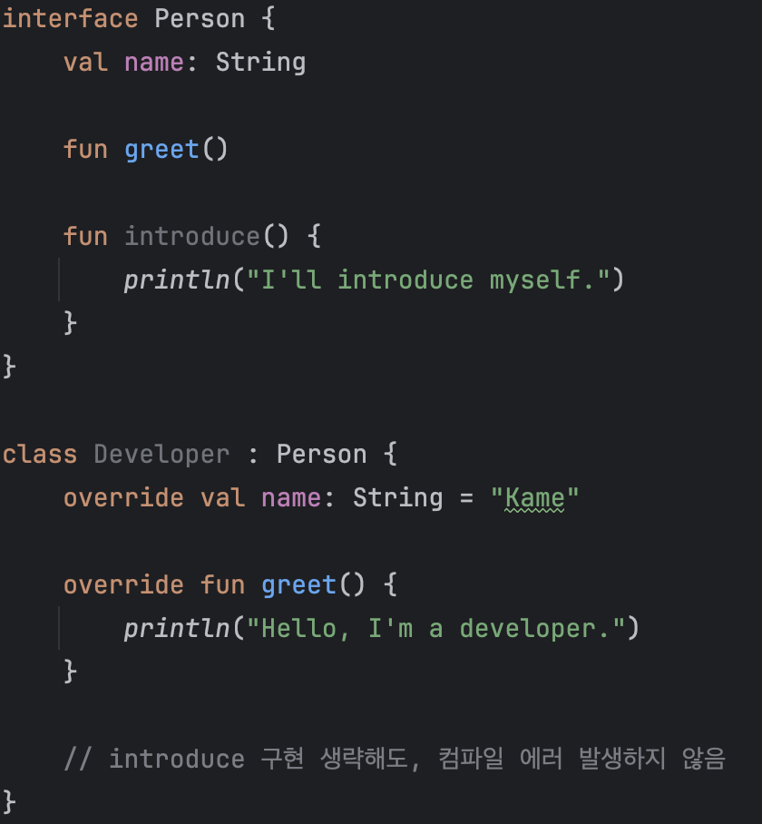

# Interface 내부에서 선언된 메서드, 구현까지 명시되어 있는게 맞을까?

> 알아보면 좋을 키워드 : Kotlin Interface Default Implementation

## interface란?
먼저, 공식문서에서 설명하고 있는 인터페이스의 정의부터 살펴보자.
> Interfaces in Kotlin can contain declarations of **abstract methods**, as well as **method implementations**. What makes them different from abstract classes is that interfaces **cannot store state.** They can have **properties**, but these need to be **abstract or provide accessor implementations**.

## interface 특징
이 내용에 따르면, interface의 주요 특징들을 다음과 같이 설명할 수 있다.
1. `메소드`는 추상 메소드로도 선언할 수 있고, **구현체로도 선언할 수 있다.**
2. **state를 저장할 수 없다**는 점에서 abstract class와 차이를 보인다.
3. 프로퍼티는 추상적으로 만들어지거나 접근자로 구현된 형태로 제공되어야 한다.

각각의 특징들에 대해 살펴보자.

### 1. 메소드는 추상적일 수도 있고, 구현된 형태(=Default Implementation)일 수도 있음
```
interface Person {
    fun sleep() // abstract method

    fun eat() {
        println("eat!") // method with default implementation... 이게 되네?
    }
}
```

### 2. state를 보유할 수 없다.
* Kotlin에서 state는 프로퍼티에 의해 `보유되는 값`(데이터)라고 생각하면 가장 편하다.
  * state를 보유할 수 없다는 것은 필드로 값을 보유할 수 없다는 것으로 생각하면 될 듯 하다.
  * 즉 필드에 들어갈 값(default value)을 할당할 수 없다.
* interface에서는 state를 가질 수 없다. 정리하면 (backing) field도 가질 수 없다.
* 따라서 아래의 코드들은 컴파일이 불가능하다.



### 3. 프로퍼티는 추상적으로 만들어지거나 접근자로 구현된 형태로 제공되어야 한다.
* state를 보유할 수 없는 대신, 접근자를 활용하여 값에 접근하도록 할 수 있다.(사실상 getter 함수를 만드는 것)
* 다만 (backing) field는 가질 수 없기 때문에 field를 생성하도록 하는 코드는 작성할 수 없다.(잘 모르겠다면 직접 작성해보고 디컴파일 해서 확인해보시오)
* 첫번째 코드는 컴파일 가능하지만, 두 번째, 세 번째 코드는 컴파일 할 수 없다. 필드를 만들어내는가 만들어내지 않는가의 차이이다.
```
interface Person {
    val name: String
        get() = "kmkim" // ok

    // 아래 함수와 사실상 같다.
    fun getName(): String = "kmkim"
}

// decompiled codes. no field
public interface Person {
   @NotNull
   String getName();

   @Metadata(
      mv = {1, 9, 0},
      k = 3
   )
   public static final class DefaultImpls {
      @NotNull
      public static String getName(@NotNull Person $this) {
         return "kmkim";
      }
   }
}
```
```
interface Person {
    val name: String
        get() = field // compile error... backing field needed
}
```
```
interface Person {
    var name: String
        get() = "kmkim"
        set(value) {
            field = value // compile error... backing field needed
        }
}
```

## 그래서 Default Implementation을 갖는 것은 Good Practice인 것인가?
> 먼저, 여러 자료들이나 StackOverflow의 질답 내용에 의하면 interface에서 default implementation을 갖는 것은 많은 개발자들로부터 선호받는 방법은 아님을 알 수 있다.

Kotlin의 기반이 되는 언어인 Java의 경우, 버전 8에서부터 interface에 default implementation을 지원하기 시작했다.

default implementation을 두는 것이 좋은 방식인지를 알기 위해서는, 자바에서 이것이 도입된 목적과 이유부터 아는 것이 필요하다.

### Default Implementation의 목적과 도입 이유
> allows the developer to add new methods to the interfaces without breaking their existing implementation. It provides the flexibility to allow interface to define implementation which will use as the default in a situation where a concrete class fails to provide an implementation for that method.

* 기존에 존재하던 구현체에 대한 파괴(추가적인 구현) 없이 인터페이스에 새로운 메소드를 추가할 수 있도록 하는 목적
* 인터페이스 측에서의 구현을 허용함으로써 구현체 측에서 해당 메소드에 대한 구현을 별도로 할 필요가 없어지게 된다.
  * 즉, 인터페이스 측에서 메소드가 추가된다고 하더라도 구현체 측에서 변경할 필요가 없게 되기 때문에 유연성을 높일 수 있다.

예시로 인터페이스와 그것을 구현한 클래스를 가져와봤다.
```
interface Person {
    val name: String
    
    fun greet()
}

class Developer : Person {
    override val name: String = "Kame"

    override fun greet() {
        println("Hello, I'm a developer.")
    }
}
```

> interface에서 Default Implementation의 목적은 Backward-Compatiblity를 달성하기 위함이다.

이 상태에서는 코드에 문제가 없다. 그런데 인터페이스에 새로운 메소드를 추가한다면 어떤 일이 일어날까?

`introduce`라는 함수를 추상적으로 추가해보자. 아래와 같이 구현 사항은 없는 상태이다.



컴파일 에러가 발생한다. `Developer`는 추상 클래스 / 인터페이스가 아닌 클래스이기 때문에, `introduce`를 반드시 구현해야만 한다.

지금 예시에서 나온 상황은 매우 간단한 예시이다. 이것을 해결하기 위해서 `Developer` 측에서 introduce 메소드를 구현하면 당장에 간단히 문제를 해결할 수 있다.



컴파일 에러가 사라졌다.

그런데, 만약 `Person`이라는 인터페이스를 수백, 수천개의 클래스에서 구현하고 있다면 어떨까?

더 나아가서, JDK 프레임워크 상의 인터페이스에 메소드를 추가해야 한다면 어떤 상황이 벌어질까?

아마 수백만줄의 코드들의 동작하지 못할 것이며, 혼돈의 카오스가 펼쳐지기 시작할 것이다.

**따라서 인터페이스 측에서 미리 구현을 진행하여, 해당 인터페이스를 구현하는 클래스들에 대한 필수적인 변경이 필요없도록 하면서 필요할 때만 오버라이딩할 수 있도록 하기 위하여 Default Implementation이라는 기능이 생겨난 것이다!**



가장 대표적인 예시로, Java 8에서 Iterable 인터페이스에 forEach라는 메소드가 추가되었던 것을 들 수 있다.

```
public interface Iterable<T> {
    // 기존 코드

    public default void forEach(Consumer<? super T> consumer) {
        for (T t : this) {
            consumer.accept(t);
        }
    }

    // 기존 코드
}
```

아래의 코드를 보면, forEach라는 메소드를 오버라이드 하지 않았음에도 에러가 발생하지 않음을 알 수 있다.
```
public class IterableExample {
    public static void main(String[] args) {
        Iterable<Integer> iterable = new Iterable<Integer>() {
            @NotNull
            @Override
            public Iterator<Integer> iterator() {
                return null;
            }
        };

        // 인터페이스 단에서 구현이 미리 되어있으므로, 바로 활용 가능
        iterable.forEach(System.out::println);
    }
}
```

만약 default implementation으로 구현해놓지 않고 다음과 같이 추상으로 남겨두었다면, 이것을 활용하는 모든 곳에서 컴파일 에러가 발생했을 것이다.
```
public interface Iterable<T> {
    public void forEach(Consumer<? super T> consumer);
}
```

### Abstract class에서의 implementation과 interface의 default implemenatation 중 어떤 것을 활용해야 하는가?
얼핏 보기에, 두 가지는 같은 것처럼 보인다. Default Implementation을 언제 활용하면 좋을지 알아보자.

답은, 앞서 설명했던 인터페이스의 특징에 있다.
> 인터페이스는 state를 보유할 수 없다.


## 참고 자료
https://medium.com/huawei-developers/kotlin-interface-example-da68b05828cd

https://stackoverflow.com/questions/74370185/what-is-meaning-of-storing-a-state-in-kotlin

https://proandroiddev.com/kotlin-interface-default-implementation-how-does-it-work-3af5056e0c03

https://dzone.com/articles/interface-default-methods-java

https://stackoverflow.com/a/18286975

https://stackoverflow.com/questions/63481986/is-it-a-good-practice-to-have-an-interface-which-has-default-implementation-for

https://www.jrebel.com/blog/using-default-methods-in-java-8#!/